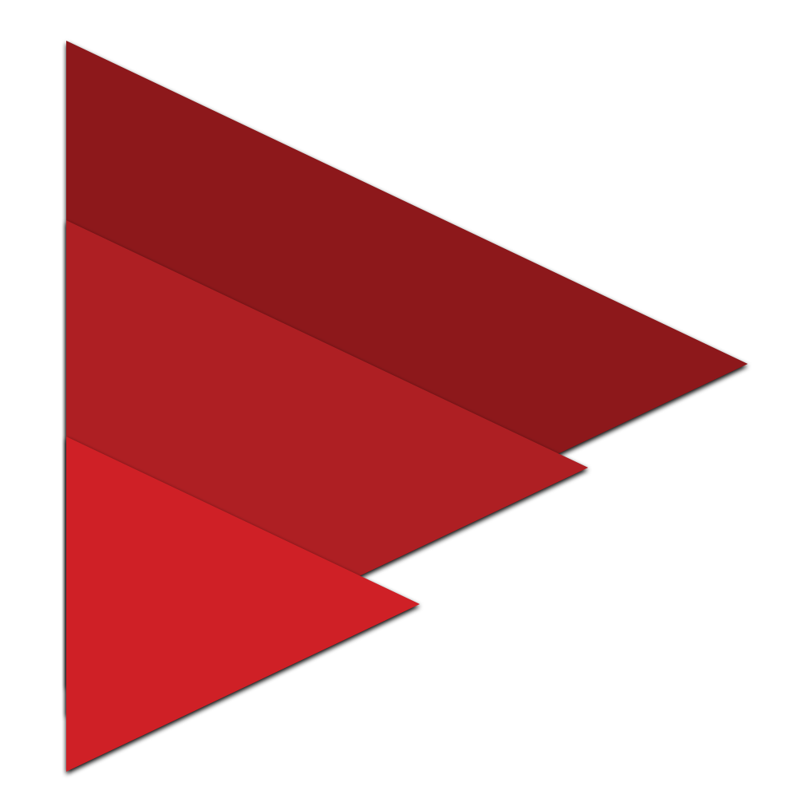

<h1 align="center">Recursive</h1>

 
 
<i>Recursive is a JavaScript framework to build beautiful applications.</i>

---

As of now, Recursive is available only for [Web](https://github.com/RiadhAdrani/recursive-web).

### Documentation

Get started with Recursive and explore the documentation:

-   [Getting Started](https://riadhadrani.github.io/recursive-docs/get-started)
-   [Core API](https://riadhadrani.github.io/recursive-docs/core)
-   [Web API](https://riadhadrani.github.io/recursive-docs/web)
